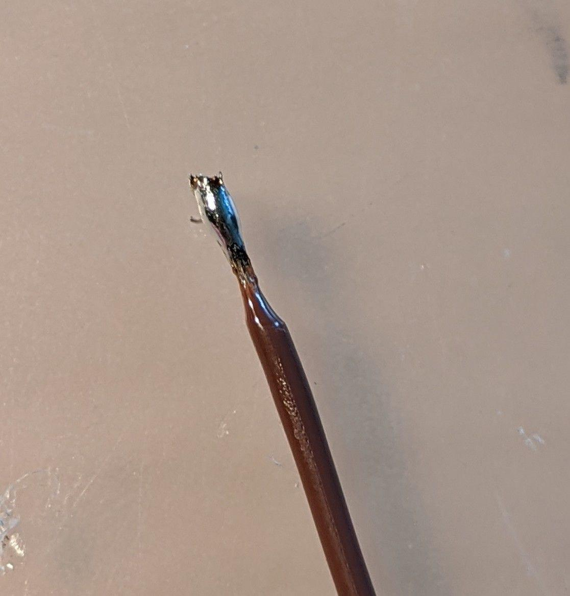
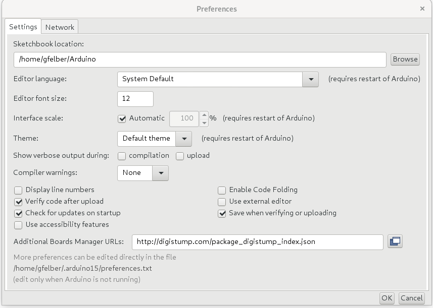
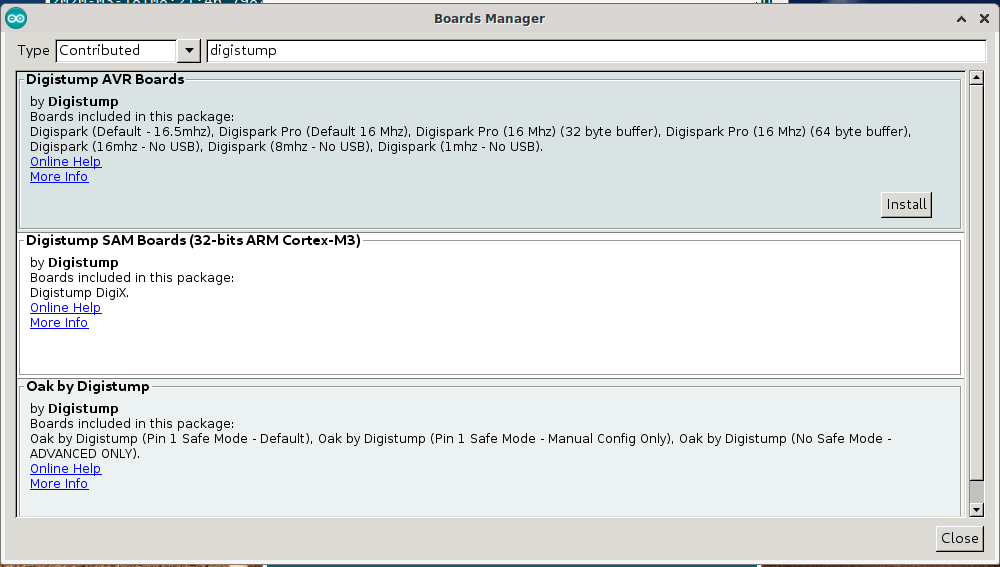
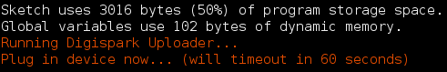

# D̴̹̭͂ë̷̗́̃̿̓̾͜ṃ̸͔͚̗̙̪̎̄̋ȏ̸̝̤̱͜n̶͇͇͙̻̩͑͑S̴̳̩̮̥͚̥̚ė̸̟̃͋͂͝e̷̪̲̪̰̣̿̀͠d̵̡̂͗


DemonSeed is a minimal malicious USB cable. Not to be confused with the O.MG Cable (https://o.mg.lol), which is a very differient piece of hardware that does a whole lot more.

## Table of Contents

+ [Intro](#intro)
+ [Materials](#materials)
+ [Assembly](#assembly)
  + [! Important side-notes !](#notes)
  + [Pogo-jig](#pogo)
  + [DemonSeed boot-loader](#boot)
  + [DemonSeed Soldering](#dsolder)
  + [DemonSeed Programming](#dprogram)
+ [Sources](#sources)

## <a name="intro"></a>Intro

[**Original Video**](https://www.youtube.com/watch?v=QQ1p2tPWZbM&list=PLW5y1tjAOzI1xRXLCU1ROeZIuyVz7aF0e&index=2)

This Protocol persist from my personal experiences with the Demon Seed it involves troubles i had and how i troubleshooted them. Also will it include some personal tips and tricks i used during my assembly.

## <a name="materials"></a>Materials

#### Needed

+ [DemonSeed EDU](https://shop.hak5.org/products/o-mg-demonseed-edu)
+ [Soldering Station](https://www.conrad.com/p/toolcraft-st-100d-soldering-station-digital-100-w-150-up-to-450-c-soldering-tip-1561696)
+ Solder
+ USB Cable

#### Advisable

+ Double sided Tape
+ [Bigger USB Housing](https://www.conrad.com/p/hood-for-usb-b-connector-bend-relief-usb-b-hood-tru-components-content-1-pcs-1582493)
+ [USB A Plug Socket](https://www.conrad.com/p/usb-a-plug-socket-horizontal-mount-ds1098-bn0-connfly-content-1-pcs-1390130)
+ Flux
+ Cables Strand (Cross section: 2 x 0.14 mm² | Outer dim.: 1.3 x 2.6 mm)
+ Extra Pins
+ Ohmmeter (or anything one can use to test conductivity)
+ Linux (Host or VM)
+ Patience


## <a name="assembly"></a>Assembly

### <a name="notes"></a>! Important side-notes !

I did my DemonSeed assembly without flux. Also I broke my Pogo-jig PCB Traces and hardwired the pins to the pogos with cables. Also I used the in the box USB port, but removed the plastic part under the contacts. Furthermore I used the Debian Buster OS for all Programming related tasks. At last i want to note that this is expanding the original [setup]( https://o.mg.lol/setup/OMGDemonSeedEDU/) with personal experiences and tips on Troubleshooting and Problem solving. At the start of each section the original Video is linked. At last i did my software installer code tests with a Kali linux guest vm through Virtual Box (Virtual Box USB drivers are needed).

### <a name="pogo"></a>Pogo-jig

[**Original Video**](https://www.youtube.com/watch?v=htCw4ws4_WI&list=PLW5y1tjAOzI1xRXLCU1ROeZIuyVz7aF0e&index=3)

#### Theory

The Pogo Jig is needed to connect the usbasp (The Module, which is used to setup the boot-loader) to the DemonSeed. In the following picture one can see the 6 pins on the DemonSeed Implant, which can be used for troubleshooting. More details on what each pad does in the [boot-loader](#boot) section.


#### Soldering

**! Important!**

put together your pogo jig before soldering it and check if your pogos can connect to the DemonSeed and that you don't soldered it backwards.


Because i broke my PCB traces i hardwired my pogo-jig with extra cables. 

**Tip:** If u do this i advise on putting tin on your cables beforehand and then use this tin to connect the cables. following Picture is an example of this procedure.



| Front                                                | Back                                                         |
| ---------------------------------------------------- | ------------------------------------------------------------ |
|  |  |

**Finished**


#### Troubleshooting

I advise on testing the conductivity from the pins to the end of each pogo. For more detail on which  pin to connect to which pogo look at the following two schematics.

**! pins for 5V, MISC and SCK are not connected to their closest pogo  !**

| Pins                                                         | Pogos                                                        |
| ------------------------------------------------------------ | ------------------------------------------------------------ |
|  |  |


### <a name="boot"></a>DemonSeed boot-loader

[**Original Video**](https://www.youtube.com/watch?v=I8zHhCQIZpY&list=PLW5y1tjAOzI1xRXLCU1ROeZIuyVz7aF0e&index=4)

#### Theory

**Connectors**


**fuse bits**


**avrdude**


#### Software Installation

```
sudo apt-get install avrdude
```


#### Programming

In order to install the boot loader you need to flash it onto the DemonSeed. This code for this is in this Repo in the file DemonSeed.hex.


**Devices**

| USBASP to REDIRECT                             | REDIRECT to POGO-JIG                             | POGO-JIG to DEMONSEED                              |
| ---------------------------------------------- | ------------------------------------------------ | -------------------------------------------------- |
|  |  |  |


```
avrdude -c usbasp -p attiny85 -s -U flash:w:DemonSeed.hex:i -U lfuse:w:0xe1:m -U hfuse:w:0xdd:m -U efuse:w:0xfe:m
```


**Output Successful**


#### Troubleshooting

**Output**

```
avrdude: error: could not find USB device with vid=0x16c0 pid=0x5dc vendor='www.fischl.de' product='USBasp'

avrdude done.  Thank you.
```

Your usbasp wasn't found try unplugging and plugin it in again. also use `usb-devices | grep fischl`(Note: Works with the DemonSeed EDU kit usbasp) to check if its there.


**Output**

```
avrdude: warning: cannot set sck period. please check for usbasp firmware update.
avrdude: error: program enable: target doesn't answer. 1 
avrdude: initialization failed, rc=-1
         Double check connections and try again, or use -F to override
         this check.


avrdude done.  Thank you.
```

Means you either aren't connected to the DemonSeed at all or your pins to pogos are wrongly wired. Just try again and if it still doesnt work


**Output**

```
avrdude: verifying ...
avrdude: verification error, first mismatch at byte 0x0000
         0x00 != 0x77
avrdude: verification error; content mismatch
```

This means one of your connections disconnected throughout the installation, just try it again. It could also mean there is not conductivity in one of your pins pogo connections. 


### <a name="dsolder"></a>DemonSeed Soldering

[**Original Video**](https://www.youtube.com/watch?v=Uh47uxOOCDg&list=PLW5y1tjAOzI1xRXLCU1ROeZIuyVz7aF0e&index=5)

#### Theory

**coming soon ...**

#### Soldering

**! Important !**

Before soldering on the cables put your usb housing on the cable, also u should skip to [DemonSeed Programming](#dprogram) before soldering cables and putting on the housing, this improves troubleshooting by a lot.


Like you can see in the picture i removed the bottom part of the plastic on the soldering side of the USB stick to make soldering easier, if you don't want to go through that hassle you can also buy a USB port that has soldering pins (example linked under Materials as Advisable).


**Done**

**! Important !**

Once again go to  [DemonSeed Programming](#dprogram) and check if everything works before soldering the cable.


| USB Head                                     | Cable                                                        |
| -------------------------------------------- | ------------------------------------------------------------ |
|  |  |


#### Troubleshooting

It is advisable once again to check conductivity. Try if your DemonSeed pins and USB pins conduct electricity and check that there are no shorts.


### <a name="dprogram"></a>DemonSeed Programming

[**Original Video**](https://www.youtube.com/watch?v=itQuLTGg8w8&list=PLW5y1tjAOzI1xRXLCU1ROeZIuyVz7aF0e&index=6)

#### Theory

**coming soon ...**

#### Software Installation

Arduino: [**Download Page**](https://www.arduino.cc/en/Main/Software)

*or*

```bash
wget https://downloads.arduino.cc/arduino-1.8.12-linux64.tar.xz -O /tmp/arduino.tar.xz
tar -xf /tmp/arduino.tar.xz -C /tmp/
sudo mv -f /tmp/arduino-1.8.12 /usr/lib/arduino
sudo bash /usr/lib/arduino/install.sh
```


**Adding the right board**

1. *start **Arduino IDE***

2. File > Preferences > Additional Boards Manager URLs:

3. *add http://digistump.com/package_digistump_index.json*

   

4. Tools > Board: > Boards Manager...

5. *Type: **Contributed***

6. *search digistump*

7. *install **Digistump AVR Boards***

   

8. *Tools > Board: > Digispark (Default - 16mhz)*

9. *Tools > Programmer: >  Micronucleus*

   

#### Programming

```c
 #include "DigiKeyboard.h"
 
 void setup() {
  // put your setup code here, to run once:
  pinMode(2, OUTPUT);
  digitalWrite(2, HIGH);
}

void loop() {
  // put your main code here, to run repeatedly:
  DigiKeyboard.println("so seedy...");
  DigiKeyboard.delay(5000);
}
```


**Program Start Output**




**Success Output**


#### Troubleshooting

If you cant compile your code there could be a problem with your rules. To resolve this add following entry.

```bash
vim /etc/udev/rules.d/49-micronucleus.rules
```

```
# UDEV Rules for Micronucleus boards including the Digispark.
# This file must be placed at:
#
# /etc/udev/rules.d/49-micronucleus.rules    (preferred location)
#   or
# /lib/udev/rules.d/49-micronucleus.rules    (req'd on some broken systems)
#
# After this file is copied, physically unplug and reconnect the board.
#
SUBSYSTEMS=="usb", ATTRS{idVendor}=="16d0", ATTRS{idProduct}=="0753", MODE:="0666"
KERNEL=="ttyACM*", ATTRS{idVendor}=="16d0", ATTRS{idProduct}=="0753", MODE:="0666", ENV{ID_MM_DEVICE_IGNORE}="1"
#
# If you share your linux system with other users, or just don't like the
# idea of write permission for everybody, you can replace MODE:="0666" with
# OWNER:="yourusername" to create the device owned by you, or with
# GROUP:="somegroupname" and mange access using standard unix groups.

```

Now reload the rules and you should be good to go.

```bash
sudo udevadm control --reload-rules
```


## <a name="sources"></a>Sources

+ [GitHub DemonSeed](https://github.com/O-MG/DemonSeed)
+ [DemonSeed Setup][https://o.mg.lol/setup/OMGDemonSeedEDU/]
+ [wikipedia](https://en.wikipedia.org/wiki/Main_Page)
  + [SPI](https://en.wikipedia.org/wiki/Serial_Peripheral_Interface)
+ [AVR Fuse Bits](https://hackaday.com/2012/08/30/avr-fuse-bits-explained/)
+ [Fuse Bits](https://embedderslife.wordpress.com/2012/08/20/fuse-bits-arent-that-scary/)

