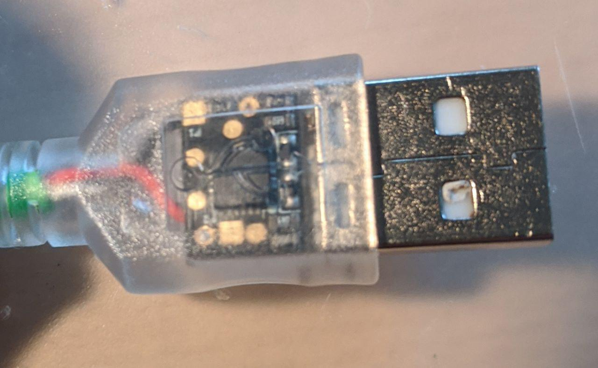

# D̴̹̭͂ë̷̗́̃̿̓̾͜ṃ̸͔͚̗̙̪̎̄̋ȏ̸̝̤̱͜n̶͇͇͙̻̩͑͑S̴̳̩̮̥͚̥̚ė̸̟̃͋͂͝e̷̪̲̪̰̣̿̀͠d̵̡̂͗


DemonSeed is a minimal malicious USB cable. Not to be confused with the O.MG Cable (https://o.mg.lol), which is a very differient piece of hardware that does a whole lot more.

## Table of Contents

+ [Intro](#intro)
+ [Materials](#materials)
+ [Assembly](#assembly)
  + [! Important side-notes !](#notes)
  + [Pogo-jig](#pogo)
  + [DemonSeed boot-loader](#boot)
  + [DemonSeed Soldering](#dsolder)
  + [DemonSeed Programming](#dprogram)

## <a name="intro"></a>Intro

[**Original Video**](https://www.youtube.com/watch?v=QQ1p2tPWZbM&list=PLW5y1tjAOzI1xRXLCU1ROeZIuyVz7aF0e&index=2)

This Protocol persist from my personal experiences with the Demon Seed it involves troubles i had and how i troubleshooted them. Also will it include some personal tips and tricks i used during my assembly.

## <a name="materials"></a>Materials

#### Needed

+ [DemonSeed EDU](https://shop.hak5.org/products/o-mg-demonseed-edu)
+ [Soldering Station](https://www.conrad.com/p/toolcraft-st-100d-soldering-station-digital-100-w-150-up-to-450-c-soldering-tip-1561696)
+ Solder
+ USB Cable

#### Advisable

+ Double sided Tape
+ [Bigger USB Housing](https://www.conrad.com/p/hood-for-usb-b-connector-bend-relief-usb-b-hood-tru-components-content-1-pcs-1582493)
+ [USB A Plug Socket](https://www.conrad.com/p/usb-a-plug-socket-horizontal-mount-ds1098-bn0-connfly-content-1-pcs-1390130)
+ Flux
+ Cables Strand (Cross section: 2 x 0.14 mm² | Outer dim.: 1.3 x 2.6 mm)
+ Extra Pins
+ Ohmmeter (or anything one can use to test conductivity)
+ Linux (Host or VM)
+ Patience


## <a name="assembly"></a>Assembly

### <a name="notes"></a>! Important side-notes !

I did my DemonSeed assembly without flux. Also I broke my Pogo-jig PCB Traces and hardwired the pins to the pogos with cables. Also I used the in the box USB port, but removed the plastic part under the contacts. Furthermore I used the Debian Buster OS for all Programming related tasks. At last i want to note that this is expanding the original [setup]( https://o.mg.lol/setup/OMGDemonSeedEDU/) with personal experiences and tips on Troubleshooting and Problem solving. At the start of each section the original Video is linked.

### <a name="pogo"></a>Pogo-jig

[**Original Video**](https://www.youtube.com/watch?v=htCw4ws4_WI&list=PLW5y1tjAOzI1xRXLCU1ROeZIuyVz7aF0e&index=3)

#### Theory

The Pogo Jig is needed to connect the usbasp (The Module, which is used to setup the boot-loader) to the DemonSeed. In the following picture one can see the 6 pins on the DemonSeed Implant, which can be used for troubleshooting. More details on what which pad does in the [boot-loader](#boot) section.


#### Soldering

Because i broke my PCB traces i hardwired my pogo-jig with extra cables. 

**Tip:** If u do this i advise on putting tin on your cables beforehand and then use this tin to connect the cables. following Picture is an example of this procedure.


| Front                                                | Back                                                         |
| ---------------------------------------------------- | ------------------------------------------------------------ |
|  |  |

**Finished**


#### Troubleshooting

I advise on testing the conductivity from the pins to the end of each pogo. For more detail on which  pin to connect to which pogo look at the following two schematics.

**! pins for 5V, MISC and SCK are not connected to their closest pogo  !**

| Pins                                                         | Pogos                                                        |
| ------------------------------------------------------------ | ------------------------------------------------------------ |
|  |  |


### <a name="boot"></a>DemonSeed boot-loader

[**Original Video**](https://www.youtube.com/watch?v=I8zHhCQIZpY&list=PLW5y1tjAOzI1xRXLCU1ROeZIuyVz7aF0e&index=4)

#### Theory

**coming soon ...**

#### Software Installation

```
sudo apt-get install avrdude
```


#### Programming

**Devices**

| USBASP to REDIRECT                             | REDIRECT to POGO-JIG                             | POGO-JIG to DEMONSEED                              |
| ---------------------------------------------- | ------------------------------------------------ | -------------------------------------------------- |
|  |  |  |


```
avrdude -c usbasp -p attiny85 -s -U flash:w:DemonSeed.hex:i -U lfuse:w:0xe1:m -U hfuse:w:0xdd:m -U efuse:w:0xfe:m
```

**Output Successful**


#### Troubleshooting

**coming soon ...**

### <a name="dsolder"></a>DemonSeed Soldering

[**Original Video**](https://www.youtube.com/watch?v=Uh47uxOOCDg&list=PLW5y1tjAOzI1xRXLCU1ROeZIuyVz7aF0e&index=5)

#### Theory

**coming soon ...**

#### Soldering


**Done**

| USB Head                                     | Cable                                                        |
| -------------------------------------------- | ------------------------------------------------------------ |
|  |  |


#### Troubleshooting

**coming soon ...**


### <a name="dprogram"></a>DemonSeed Programming

[**Original Video**](https://www.youtube.com/watch?v=itQuLTGg8w8&list=PLW5y1tjAOzI1xRXLCU1ROeZIuyVz7aF0e&index=6)

#### Theory

**coming soon ...**

#### Software Installation

[**Download Page**](https://www.arduino.cc/en/Main/Software)

or


**coming soon ...**

#### Programming

```c
 #include "DigiKeyboard.h"
 
 void setup() {
  // put your setup code here, to run once:
  pinMode(2, OUTPUT);
  digitalWrite(2, HIGH);
}

void loop() {
  // put your main code here, to run repeatedly:
  DigiKeyboard.println("so seedy...");
  DigiKeyboard.delay(5000);
}
```

**Program Start Output**


**Success Output**


